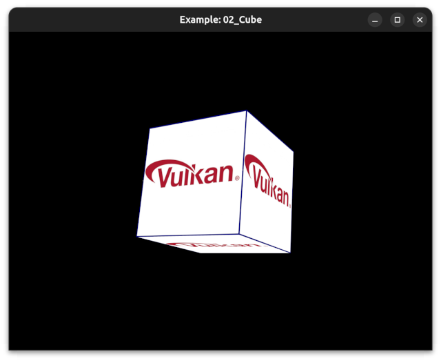

# Vulkan Samples

This project contains a set of Vulkan samples, using the Window, vkUtils and Vexel libraries.  
It builds with QtCreator, Android Studio or MSVC2022.  
It runs on Windows, Linux and Android.  

The Window library creates the window, and handles Keyboard, Mouse and Touch screen input.  
The unified API simplifies cross platform development and ensures consistent behavior on all three platforms.  

The Vexel library loads Vulkan functions and extensions... an alternative to vulkan_wrapper or Volk.  

The vkUtils library is an abstraction layer over Vulkan, and uses VMA for memory management.  

## Dependencies:

- argparse (select gpu with terminal argument: --gpu #)
- VMA (Vulkan Memory Allocator)
- stb_image (for loading jpg and png images)
- tiny_gltf (Load glTF models)
- json.hpp (required by tiny_gltf)
- ImGui (Remember to pull its git submodule.)

### Linux:
run dependencies.sh  

### Windows:

Install python3   
cd ./libs/vkUtils/Vexel   
python3 vexel_gen.py -dg   

# Samples

### 01_keyEvents

Creates a blank window, and prints events to the console.  

---

### 02_cube

Renders a spinning cube.  
Responds to mouse/touchscreen events.  
Drag mouse or touchscreen, to change rotation angle.  
Mouse-wheel or two-finger-pinch to zoom.

---

### 03_glTF

Renders a glTF model using PBR.  
Responds to mouse/touchscreen events to change camera angle and zoom.  

---

### 04_vkRay

Renders a glTF model using either rasterization or Raytracing.  
Responds to mouse/touchscreen events to change camera angle.  
Press space to switch between raster and raytrace mode.  
(Raytracing is not supported on Android)  

---

### 05_ImGui

Renders a glTF model, with imgui menu overlay.  
Imgui menu responds to mouse events.  
Background mouse events adjust camera angle and zoom.  
This is just 03_glTF, with an ImGui overlay added.  

---

